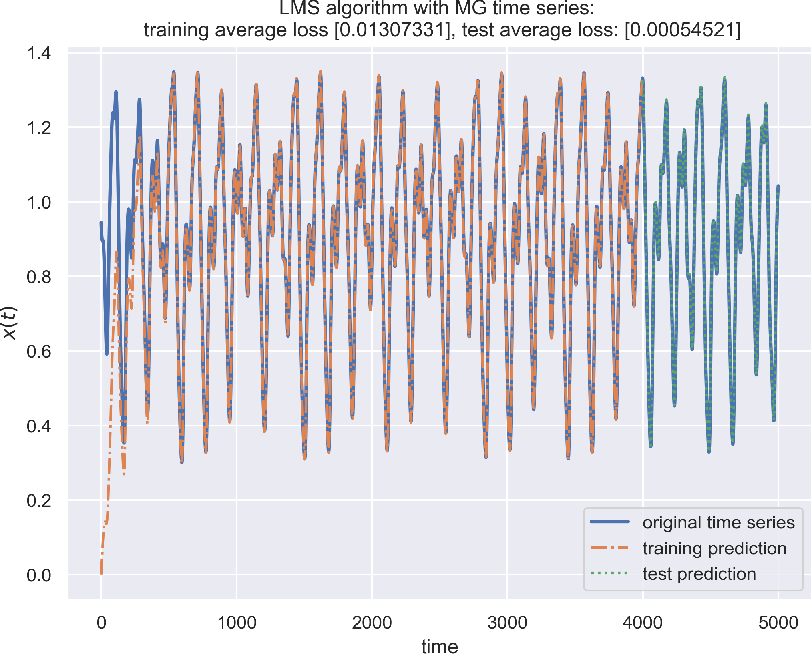

## EEE 511 Team Assignment 01 

### Team 03:

- Jian Meng (jmeng15@asu.edu)
- Manvitha Pannala (mpannal1@asu.edu)
- Siyuan Xiang (sxiang8@asu.edu)


### Widrow-Hoff’s LMS algorithm for Mackey Glass time series prediction



#### Run & Test the LMS algorithm

The dataset (time series) can be generated through `mackey_glass_series.py` 

```python
python3 mackey_glass_series.py
```

The source code is from [NoLiTSA](https://github.com/manu-mannattil/nolitsa). The generated dataset will be directly saved into the `./mackey-glass/data/` folder. 


**To run / test the LMS algorithm:** 

```python
python3 widrow_hoff.py
```

**Requirements**

```python
python 					  3.7.5
seaborn                   0.9.0
numpy                     1.17.4
matplotlib                3.1.1
```

It is also feasible to test the LMS algorithm without using the `seaborn`, comment out line 14 of `widrow_hoff.py` then use. 

