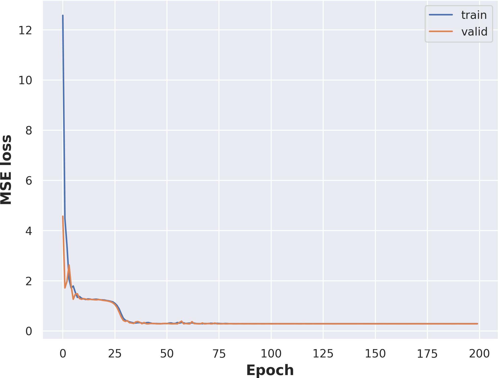

# EEE 511 Team assignment 02

## Team 03

- Jian Meng ([jmeng15@asu.edu](mailto:jmeng15@asu.edu))
- Manvitha Pannala ([mpannal1@asu.edu](mailto:mpannal1@asu.edu))
- Siyuan Xiang ([sxiang8@asu.edu](mailto:sxiang8@asu.edu))

### Kaggle Happiness Score regression 

For the source dataset, please check the .pdf file: [3 TeamAssignment-happiness score.pdf](https://github.com/mengjian0502/eee511_team3_assignment/blob/master/assignment02/3 TeamAssignment-happiness score.pdf)

The dataset was directly downloaded from the Kaggle website: https://www.kaggle.com/unsdsn/world-happiness

- The objective of the assignment is to complete the regression task by using two different kinds of algorithms
  - Multi-variable linear regression
  - Multi layer preceptron 

The input include following features that extracted from the combined dataset: 

- GDP
- Family 
- Health
- Freedom
- Generosity
- Corruption

The target output is the happiness scores. 

#### Data cleaning

Before sending the dataset into the model for training / test, the dataset was constructed by combining all separate csv files from 2015 to 2019. We wrote the code to extract features and combine the data samples together. The source code can be found in `utils.py`. 

#### Run & Test the linear regression model

To run the linear regression model, please type. 

The trained model will be stored in the `save_lr` folder under the running directory.

```python
python3 LinearRegression.py
```

The minimum loss that the model achieved is **0.2908**

#### Run & Test the MLP model

To run the multi-layer perceptron, please type:

```python
python3 multi_percptron.py
```

The trained model will be stored in the `save` folder under the running directory.

The minimum loss that the mlp can achieved is **0.2860**

##### Structure of the MLP


##### Training Parameters

- Base learning rate: 0.1
- Scheduled learning rate decay: [80, 120]
- Learning decay ratio: [0.1, 0.5]
- Total training epochs: 200
- Optimizer: SGD

### Results report

#### Linear regression training & validation


#### Multi-layer Perceptron training & validation



### Requirements

```python
python 	    3.7.5
seaborn     0.9.0
numpy       1.17.4
matplotlib  3.1.1
pytorch     1.3.1
pandas      0.25.1
```

It is also feasible to test the LMS algorithm without using the `seaborn`, comment out line 18 of `multi-perceptron.py` then use.

