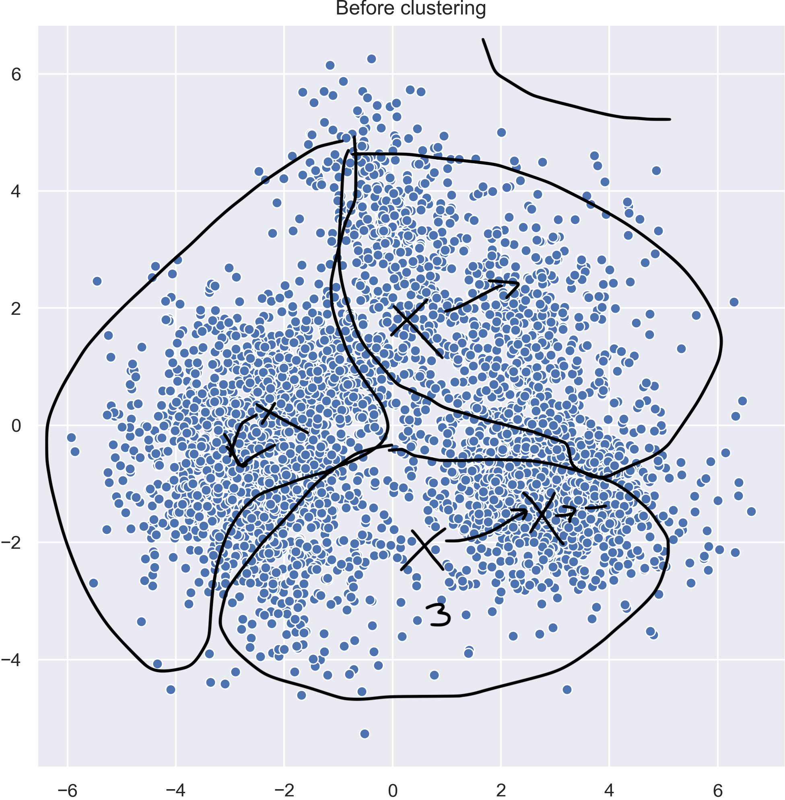
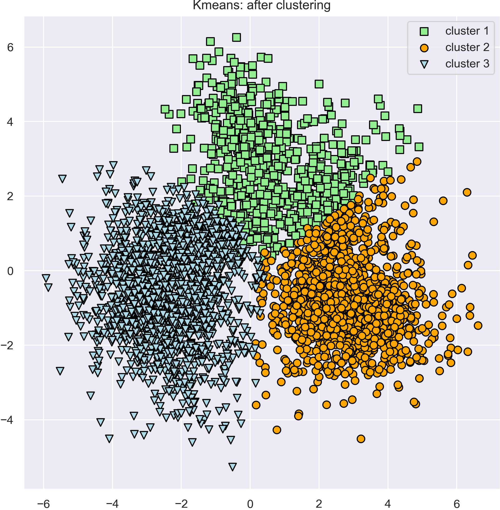
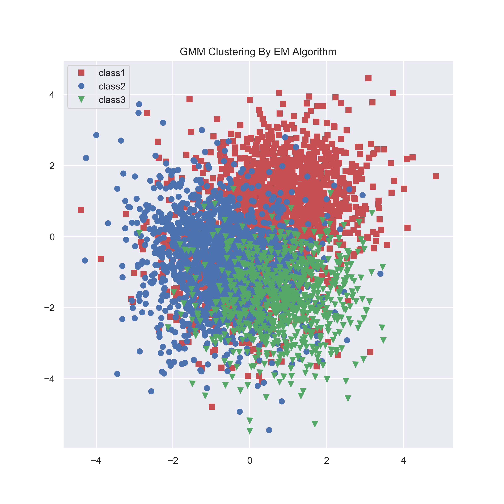

# EEE511 Team assignment 04 - clustering

### Team 03

- Jian Meng
- Manvitha Pannala
- Siyu Xiang

------

Use the following two methods to cluster the given dataset (D1_2.amt).

- K-means
- EM and Gaussian mixture models (GMM)

### Data preprocessing

In this assignment, we successully implemented the K-means & GEMM method based on the given dataset. 

Since the given dataset is in `.mat` format. Therefore we cannot directly load it as a numpy array, so we utlized the `scipy.io.loadmat` to load the .mat file, then convert the `labels` and `samples` to numpy array.

The data samples and the corresponding cluster labels are saved as `./data/samples.npy` and `./data/labels.npy`. 

To visualize the 5 dimensional datasamples without loose the generality, we perform the PCA first to visualize the data samples: 



### Kmeans Clustering algorithm

- **Input:** Number of clusters $K$, datasets $X = [x_1, x_2, \dots, x_n]$  
- **Initialization:** Randomly set the centroids $c_1, c_2, \dots c_K$
- **Repeat until convergence:**
  - For each data point, find the nearest centroid $c_j$ 
    - Assign the point to cluster $j$
  - For each cluster 
    - Assign the new centroid as the mean of all the data points has been clustered as $j$ in the previous step. 
- Stop the entire process when the cluster assignment is stable. 

To run the Kmeans algorithm: 

```python
python kmeans.py --clusters [Number of clusters, default=3] 
```

**Example output (Clusters = 3)**




### GEMM Clustering algorithm

**Example output (Cluster = 3)**



To run the GEMM algorithm:

```python
python gemm.py --clusters [Number of clusters, default=3] 
```


#### Requirement

```python
python 3.7.4
scipy 1.3.1
numpy 1.17.4
seaborn 0.9.0
```

