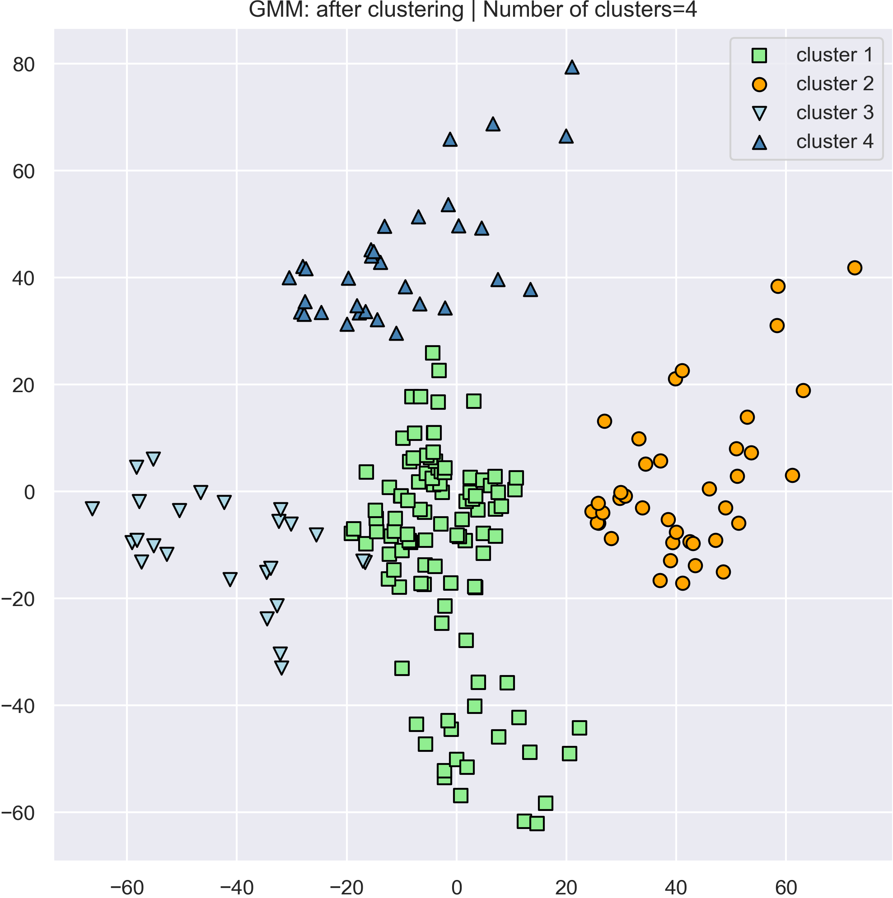

# EEE511 Team 2nd midterm -- clustering

### Team 03

- Jian Meng
- Manvitha Pannala
- Siyu Xiang

------

Use the following two methods to cluster the given Customer Segmentation [Dataset](https://www.kaggle.com/vjchoudhary7/customer-segmentation-tutorial-in-python#Mall_Customers.csv)

- K-means
- EM and Gaussian mixture models (GMM)

------

### Data Pre-processing  

- We have checked the dataset for any missing values using null function.But, there were no null values.
- We analysed individual features in asssosication with 'gender' and noticed that from the below plot in the following figure,  we see that gender has no direct relation to segmenting customers. That's why we can drop it and move on with other features which is why we will X parameter from now on.


The dataset that we used has been converted from `.csv` file to `.npy ` file then saved into `./data` folder. 

------

### Kmeans

We applied the Kmeans algorithm to the processed dataset with the objective of analyze the relationship between the attribute and the sales. 

#### Example run: K = 4


To run the script please excecute the following command in the terminal:

```python
python kmeans.py --clusters [Number of clusters within 4, 6, 8, 10]
```

We also performed the two feature analysis with Kmeans (see the report for details)

```python
python kmeans_two_features.py --clusters [Number of clusters within 4, 6, 8, 10]
```


------

### EM on GMM

With the objective of clustering, we also applied GEMM algorithm to the given dataset, the report has summarized the algorithm & details about the GEMM.

#### Example run: K=4



To run the script please excecute the following command in the terminal:

```python
python gemm_sklearn.py --clusters [Number of clusters within 4, 6, 8, 10]
```

We also performed the two feature analysis with Kmeans (see the report for details)

------

### Requirements

```python
python 3.7.4
scipy 1.3.1
numpy 1.17.4
seaborn 0.9.0
sklearn 0.21.3
```

